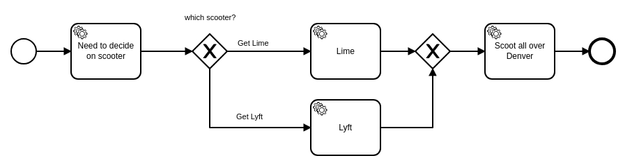

# Camunda Spring Boot Application
Spring Boot Application using [Camunda](http://docs.camunda.org).

This project has been generated by the Maven archetype
[camunda-archetype-spring-boot-7.10.0](http://docs.camunda.org/latest/guides/user-guide/#process-applications-maven-project-templates-archetypes).

## Show me the important parts!
[BPMN Process](src/main/resources/scooter.bpmn)



## How does it work?

In this example, Camunda orchestrates 4 microservice workers that live somewhere other than application server context where Camunda resides.

Three of these workers are authored in JavaScript (using node.js), while the final worker is written in Java.

This workflow follows the "External Task Pattern" in Camunda, where workers subscribe to a "topic" in Camunda, then they poll Camunda for available work.  This allows for easy horizontal scaling of your microservices.

## How to use it?

1.  After starting up Camunda, start an instance of the "scooter" workflow, either with Tasklist, or with the REST API.  Once the instance has started, it will move forward to the "Need to decide on scooter" external task, then it will stop.  It is waiting for a worker to pick it up.

2. start your JavaScript workers.  From the command line, change directory to the "external-workers-nodejs" and run:

```bash
node workers.js
```
3.  Review the workflow instance in Cockpit, and you will see that the workers picked up work to which they were subscribed.  Your workflow is now waiting at the final activity, "Scoot all over Denver".

4.  Now we start the final worker.  Find the java class "org.camunda.demo.workers.ScootWorker" and execute it as a stand alone Java application.

5.  Return to Cockpit to see that the Java microservice picked up the available work from Camunda and completed the task.  The process instance should now be complete.

### Unit Test
You can run the JUnit test [InMemoryH2Test](src/main/resources/archetype-resources/src/test/java/ProcessTest.java) in your IDE or using:
```bash
mvn clean test
```

### Running the application
You can also build and run the process application with Spring Boot.

#### Manually
1. Build the application using:
```bash
mvn clean package
```
2. Run the *.jar file from the `target` directory using:
```bash
java -jar target/Camunda Spring Boot Application.jar
```

For a faster 1-click (re-)deployment see the alternatives below.

#### Maven Spring Boot Plugin
1. Build and deploy the process application using:
```bash
mvn clean package spring-boot:run
```

#### Your Java IDE
1. Run the project as a Java application in your IDE using CamundaApplication as the main class.

### Run and Inspect with Tasklist and Cockpit
Once you deployed the application you can run it using
[Camunda Tasklist](http://docs.camunda.org/latest/guides/user-guide/#tasklist)
and inspect it using
[Camunda Cockpit](http://docs.camunda.org/latest/guides/user-guide/#cockpit).

## Environment Restrictions
Built and tested against Camunda BPM version 7.10.0.

## Known Limitations

## License
[Apache License, Version 2.0](http://www.apache.org/licenses/LICENSE-2.0).

<!-- HTML snippet for index page
  <tr>
    <td></td>
    <td><a href="snippets/scooter">Camunda Spring Boot Application</a></td>
    <td>Spring Boot Application using [Camunda](http://docs.camunda.org).</td>
  </tr>
-->
<!-- Tweet
New @Camunda example: Camunda Spring Boot Application - Spring Boot Application using [Camunda](http://docs.camunda.org). https://github.com/camunda-consulting/code/tree/master/snippets/scooter
-->
